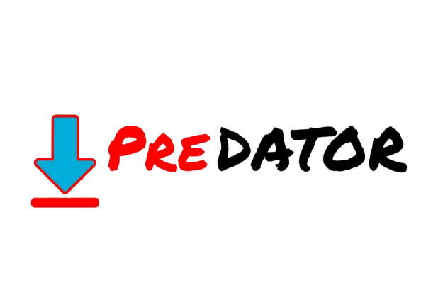

# Predator

<p align="center">

</p>

A simple desktop app for grabbing videos and audio from YouTube and Instagram. Built with Go and Wails (web tech frontend), using yt-dlp under the hood to do the heavy lifting.

## What it does

- **Download videos** from YouTube in any resolution from 144p up to 4K
- **Grab audio only** in MP3, M4A, Opus, or WAV format
- **Works with Instagram too** - reels, posts, stories, TV videos
- **Playlist support** - Download entire YouTube playlists or pick specific videos
- **Shows file sizes** before you download so you know what you're getting into
- **Live progress tracking** - Watch speed, ETA, and percentage in real-time
- **Cancel anytime** - Change your mind? Hit cancel and it stops cleanly
- **Picks up where it left off** - Failed downloads auto-retry up to 3 times
- **Duplicate detection** - Warns if you already downloaded something
- **Choose where files go** - Set your download folder once, it remembers
- **Keeps history** - See what you've downloaded, filter by video/audio, open files directly
- **Dark and light themes** - Toggle with Ctrl+T

## Getting started

You'll need **Go 1.24 or newer** installed.

```bash
git clone https://github.com/Aswanidev-vs/Predator.git
cd Predator
go mod download
```

To run in development mode:

```bash
wails dev
```

To build the actual app:

```bash
wails build
```

**First time setup:** The app will ask to download yt-dlp and ffmpeg automatically. Just say yes - it handles everything and caches them locally. No need to install anything else manually.

## How to use

1. **Open the app** - It'll show the main download tab
2. **Set your download folder** - Click "Change Download Location" (or it'll use the current folder)
3. **Paste a URL** - YouTube or Instagram links both work
4. **Pick your format:**
   - For video: Choose resolution (144p to 4K, or "best")
   - For audio: Pick format (MP3, M4A, Opus, WAV)
5. **Hit download** - Watch the progress bar do its thing

**Pro tips:**
- **Ctrl+L** - Focus the URL input
- **Ctrl+D** - Start download (when button is active)
- **Ctrl+T** - Toggle dark/light theme
- **Esc** - Close any open modal
- Playlists show a modal where you can select specific videos to download
- Click the folder icon in history to open where a file is saved

## A few things to know

- **Resolutions:** The app tries to get exactly what you picked. If that's not available, it falls back to the next best quality automatically.
- **Video format:** Everything gets merged into a single MP4 file with H.264 codec for maximum compatibility.
- **Audio quality:** Uses the best available source and converts to your chosen format.
- **Downloads folder:** Set via the button or environment variable `PREDATOR_OUTPUT_DIR`.
- **History:** Stored locally in `~/.predator/history.json` (keeps last 100 items).
- **Concurrent downloads:** Max 3 at a time to not overwhelm your connection.
- **Partial files:** If you cancel, the app cleans up `.part` and temp files automatically.

## Requirements

- Go 1.24+
- Internet connection (obviously)
- yt-dlp and ffmpeg (auto-installed on first run)

## Legal stuff

**This tool is for educational and personal use only.** 

- Respect copyright laws and YouTube's Terms of Service
- Only download content you own or have permission to download
- Don't use this to redistribute copyrighted material
- The authors aren't responsible for how you use this tool

Basically: be cool, don't pirate stuff you shouldn't.

## License

MIT License - see [LICENSE](LICENSE) file.

---

Built with [Wails](https://wails.io/) + Go + vanilla JS. No React, no bloat.
